<!-- TOC -->

- [Kubernetes HTTP Fileserver](#kubernetes-http-fileserver)
  - [Serving static files from inside a Docker Container](#serving-static-files-from-inside-a-docker-container)
  - [Serving static files from a PersistentVolume (Recommended)](#serving-static-files-from-a-persistentvolume-recommended)
    - [Create a PersistentVolume](#create-a-persistentvolume)
    - [Create a PersistentVolumeClaim](#create-a-persistentvolumeclaim)
    - [Create a Pod](#create-a-pod)
    - [Creating the Service](#creating-the-service)
    - [Troubleshooting a Service](#troubleshooting-a-service)
    - [Adding it to our NGINX Ingress](#adding-it-to-our-nginx-ingress)
    - [Deployment](#deployment)
    - [Troubleshooting the NGINX Ingress](#troubleshooting-the-nginx-ingress)
    - [Adding TLS to your Ingress](#adding-tls-to-your-ingress)
    - [Volume Access Control](#volume-access-control)

<!-- /TOC -->


# Kubernetes HTTP Fileserver

## Serving static files from inside a Docker Container

1. Create a Dockerfile to work with the [official NGINX Docker Container](https://hub.docker.com/_/nginx) that will copy all the content from the __download folder__ to the __public directory__ of the NGINX server:


```yaml
FROM nginx
COPY downloads/ /usr/share/nginx/html
```


2. Build the image and tag it for your Docker repository:


```bash
docker build -t my-docker-hub-account/http-fileserver-kubernetes .
```


3. (Optional) Test run your container:


```bash
docker run -d -p 8080:80 my-docker-hub-account/http-fileserver-kubernetes
```

You should now be able to access the files you stored inside the __downloads folder__ via `http://localhost:8080/dl/test.txt` (assuming that you used the __downloads__ folder from the repository, that contains a sub directory __dl__ that contains a text file __test.txt__):


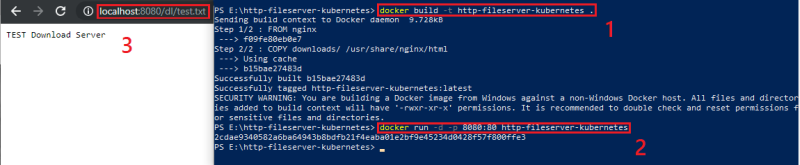


4. Push the Docker Image to Docker hub


```bash
docker login
docker push my-docker-hub-account/http-fileserver-kubernetes
```


Alternatively, do your build on the host system where you want to run the image - so the image is in local storage. This is a __hacky solution__ that is not fully supported - if you don't want to push your image to the Docker Hub, you are supposed to use a local/personal registry for your Docker images. That feels a little bit much for my problem here - so I will proceed with this way.

__Note__: if you want to use the local image, you have to build the image on every Node server that you are using in Kubernetes and that might be used to spawn the pod. You also have to set the `imagePullPolicy= Never` (see YAML file in the next step)! This will make sure that Kubernetes will always use the image from local storage instead of trying to pull it from Docker Hub.


5. Creating the Kubernetes Deployment


```yaml
apiVersion: extensions/v1beta1
kind: Deployment
metadata:
  creationTimestamp: null
  labels:
    service: http-fileserver
  name: http-fileserver
spec:
  replicas: 1
  strategy: {}
  template:
    metadata:
      creationTimestamp: null
      labels:
        service: http-fileserver
    spec:
      containers:
      - image: my-docker-hub-account/http-fileserver-kubernetes:latest
        imagePullPolicy: Always
        name: http-fileserver
        resources: {}
      restartPolicy: Always
status: {}

---

apiVersion: v1
kind: Service
metadata:
  creationTimestamp: null
  labels:
    service: http-fileserver
  name: http-fileserver
spec:
  ports:
    - name: http
      port: 80
  selector:
    service: http-fileserver
status:
  loadBalancer: {}
```


Alternatively use a simple pod, instead of a deployment:


```yaml
kind: Pod
apiVersion: v1
metadata:
  name: http-fileserver
  labels:
    app: fileserver
spec:
  containers:
    - name: http-fileserver
      image: my-docker-hub-account/http-fileserver-kubernetes:latest
      imagePullPolicy: Always
      ports:
        - containerPort: 80

---

kind: Service
apiVersion: v1
metadata:
  name: http-fileserver
spec:
  selector:
    app: fileserver
  ports:
    - port: 80
```


6. You can run the deployment (or pod) by the Kubernetes command - see [Kubernetes Ingress](https://mpolinowski.github.io/kubernetes-nginx-ingress/):


```bash
kubectl create -f http-fileserver.yaml
```


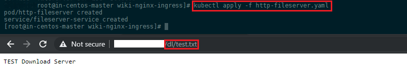


## Serving static files from a PersistentVolume (Recommended)

If all you have to serve are a few text files, the above solution will be sufficient. But what if we are talking about a large quantity of files you want to make available over the internet? Adding your files to a persistent storage and linking it to all services that need to have access to it will be the way to go.


To accomplish this we need to do the following tasks:

1. Create a __PersistentVolume__ that is backed by physical storage but is not associate with any Pod.
2. Create a __PersistentVolumeClaim__, which gets automatically bound to a suitable __PersistentVolume__.
3. Create a __Pod__ that uses the __PersistentVolumeClaim__ as storage.


### Create a PersistentVolume

Let's start with creating a folder that is going to hold our files, e.g. `/opt/filecontainer/dl`, and a file to it that you want to serve:


```js
mkdir /opt/filecontainer/dl
echo 'This is a test' > /opt/filecontainer/dl/index.txt
```


We will create a __hostPath PersistentVolume__. Kubernetes supports hostPath for development and testing on a single-node cluster. A hostPath PersistentVolume uses a file or directory on the Node to emulate network-attached storage (see Google Compute Engine persistent disk, an NFS share, or an Amazon Elastic Block Store volume instead if you are using the corresponding cloud solutions).


The configuration file for the hostPath PersistentVolume looks like this:


__file-storage-pv.yaml__

```yaml
kind: PersistentVolume
apiVersion: v1
metadata:
  name: file-storage-volume
  labels:
    type: local
spec:
  storageClassName: manual
  capacity:
    storage: 5Gi
  accessModes:
    - ReadWriteOnce
  hostPath:
    path: "/opt/filecontainer"
```
<!-- /opt/http-fileserver/downloads -->


The configuration file specifies that the volume is at `/opt/filecontainer` on the cluster’s Node. The configuration also specifies a size of _3Gi_ and an access mode of _ReadWriteOnce_, which means the volume can be mounted as read-write by a single Node. It defines the StorageClass name manual for the PersistentVolume, which will be used to bind PersistentVolumeClaim requests to this PersistentVolume.


Create the PersistentVolume:


```bash
kubectl apply -f file-storage-pv.yaml
kubectl get pv file-storage-volume
```


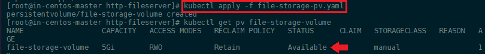


The output shows that the PersistentVolume has a STATUS of Available.


### Create a PersistentVolumeClaim

The next step is to create a __PersistentVolumeClaim__. Pods use PersistentVolumeClaims to request physical storage. In this exercise, you create a PersistentVolumeClaim that requests a volume of at least three gigs that can provide read-write access for at least one Node.

Here is the configuration file for the PersistentVolumeClaim:


__file-storage-pvc.yaml__

```yaml
kind: PersistentVolumeClaim
apiVersion: v1
metadata:
  name: file-storage-claim
spec:
  storageClassName: manual
  accessModes:
    - ReadWriteOnce
  resources:
    requests:
      storage: 3Gi
```


After you create the PersistentVolumeClaim, the Kubernetes control plane looks for a PersistentVolume that satisfies the claim’s requirements. If the control plane finds a suitable PersistentVolume with the same StorageClass, it binds the claim to the volume.


```bash
kubectl apply -f file-storage-pvc.yaml
kubectl get pv file-storage-volume
```


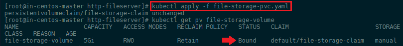


Now the output shows a STATUS of Bound.


### Create a Pod

The next step is to create a Pod that uses your PersistentVolumeClaim as a volume.

Here is the configuration file for the Pod:


__file-storage-pod.yaml__

```yaml
kind: Pod
apiVersion: v1
metadata:
  name: file-storage
  labels:
    app: file-storage
spec:
  volumes:
    - name: file-storage-volume
      persistentVolumeClaim:
       claimName: file-storage-claim
  containers:
    - name: file-storage-container
      image: nginx
      ports:
        - containerPort: 80
          name: file-storage
      volumeMounts:
        - mountPath: "/usr/share/nginx/html"
          name: file-storage-volume
```


Create the Pod and verify that the Container in the Pod is running:


```bash
kubectl create -f file-storage-pod.yaml
kubectl exec -it file-storage -- /bin/bash
```


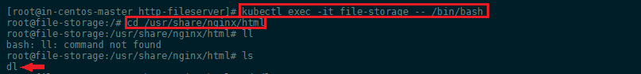


We can see that our `/opt/filecontainer` folder was successfully mounted to `/usr/share/nginx/html` !

We can also test if NGINX is running and serving our content by installing `curl` inside the container and checking if the file is available on localhost:


```bash
apt update
apt install curl
curl http://localhost/dl/index.txt
```


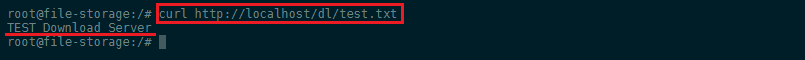


The file we created is being served by the NGINX web service!


### Creating the Service

To access the pod we first have to create a service that point to it:


__file-storage-service.yaml__

```yaml
apiVersion: v1
kind: Service
metadata:
  creationTimestamp: null
  labels:
    app: file-storage
  name: file-storage
spec:
  ports:
    - name: http
      port: 80
  selector:
    app: file-storage
status:
  loadBalancer: {}
```


### Troubleshooting a Service

I am returning here after noticing that the Ingress, I am going to add in the next step, does not seem to work. We already tested that the pod we created is running, has the PersistentVolume mounted and is hosting our content - so maybe the service is not attached to the pod?

What happens if a Service does not seem to work? We can follow the [Kubernetes Debug Guide](https://kubernetes.io/docs/tasks/debug-application-cluster/debug-service/) to check where the issue lies.


We can start by checking if the pod we created can be found by it's label


```bash
kubectl get pods -l app=file-storage
```


Assuming you have another Pod that already consumes the Service by name you would get something like:


```bash
wget -O- file-storage
Resolving file-storage (file-storage)... failed: Name or service not known.
wget: unable to resolve host address ‘file-storage’
```


So the first thing to check is whether that Service actually exists:


```bash
kubectl get svc file-storage
NAME           TYPE        CLUSTER-IP     EXTERNAL-IP   PORT(S)   AGE
file-storage   ClusterIP   10.102.5.116   <none>        80/TCP    14h
```


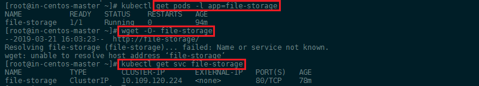


The Pod is available, the service is running, but we are not getting access to the service using the `wget` command. Also a `curl file-storage:80/dl/test.txt` fails - is there something wrong with the DNS resolution?


Trying to access the pod through the service works without a hitch, when using the Cluster IP address:


```bash
curl 10.102.5.116:80/dl/test.txt
```


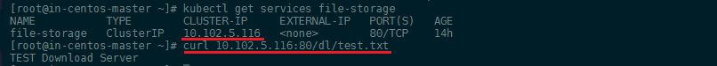


I am turning a bit in circles now - the __POD__ can be selected by the same label the __SERVICE__ is using to find the service (`app=file-storage`). The service correctly uses the as __ENDPOINT__ `kubectl get endpoints file-storage` (`10.32.0.54:80`) - we can verify that this IP is really the IP of our pod by running `kubectl get pod file-storage -o wide`.


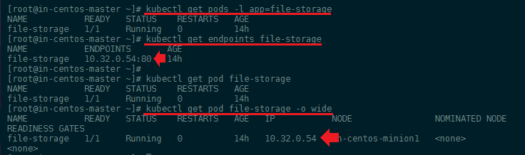


If no endpoint is found for `file-storage`, you should check that the spec.selector field of your Service actually selects for `metadata.labels` values on your Pods. A common mistake is to have a typo or other error, such as the Service selecting for `service: file-storage`, but the Deployment specifying `app: file-storage`.


Both the pod and the service are working and the services is finding our pod - everything seems to be as it should be... onward with [Troubleshooting the Ingress](#troubleshooting-the-nginx-ingress).


### Adding it to our NGINX Ingress


To route traffic to our cluster we are using the [NGINX Ingress](https://mpolinowski.github.io/kubernetes-nginx-ingress/) - in theory we only have to add our service to the [Ingress Configuration](https://mpolinowski.github.io/kubernetes-nginx-ingress/#preparing-the-nginx-ingress) and assign it to a sub-URL that we want to use:


__nginx-ingress.yaml__

```yaml
apiVersion: extensions/v1beta1
kind: Ingress
metadata:
  name: nginx-ingress
spec:
  rules:
  - http:
      paths:
        - path: /web
          backend:
            serviceName: web-service
            servicePort: 5678
        - path: /mobile
          backend:
            serviceName: mobile-service
            servicePort: 5678
        - path: /test
          backend:
            serviceName: test-service
            servicePort: 3000
        - path: /dl
          backend:
            serviceName: file-storage
            servicePort: 80
```

__Note__ that we could use the annotation [ingress.kubernetes.io/rewrite-target: /](https://github.com/kubernetes/ingress-nginx/blob/master/docs/user-guide/nginx-configuration/annotations.md#rewrite) to rewrite all incoming traffic to root. That means that, even though you are able to access the file storage app on `/dl` the app will register this traffic relative to `/` instead.


```yaml
apiVersion: extensions/v1beta1
kind: Ingress
metadata:
  name: nginx-ingress
  annotations:
    ingress.kubernetes.io/rewrite-target: /
    ...
```


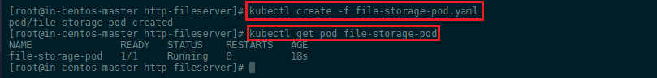


We are now able to access the fileserver over the WAN IP address of your Kubernetes MASTER Server:


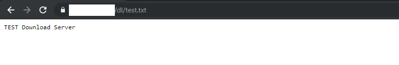


### Deployment

We can now delete the Pod and rewrite it as a __Kubernetes Deployment__


__file-storage-development.yaml__

```yaml
apiVersion: apps/v1
kind: Deployment
metadata:
  name: file-storage
  labels:
    app: file-storage
spec:
  selector:
    matchLabels:
      app: file-storage
  strategy:
    type: Recreate
  template:
    metadata:
      labels:
        app: file-storage
    spec:
      containers:
      - name: file-storage-container
        image: nginx
        ports:
        - containerPort: 80
          name: file-server
        volumeMounts:
          - mountPath: "/usr/share/nginx/html"
            name: file-storage-volume
        imagePullPolicy: Always
        resources: {}
      volumes:
        - name: file-storage-volume
          persistentVolumeClaim:
           claimName: file-storage-claim
```


Create the development and verify that the Pod is running:


```bash
kubectl create -f file-storage-development.yaml
kubectl get development file-storage
kubectl get pods
```

The pod should now be listed two blocks characters attached to the pod name - assigning it to your deployment and replicaset: e.g. `file-storage-74bdcc99c4-bhfnb`.


You can use the same troubleshooting we [used before](#create-a-pod) to check if the Pod is operational and [connected to your service](#troubleshooting-a-service).


### Troubleshooting the NGINX Ingress


There are many ways to [troubleshoot the ingress-controller](https://github.com/kubernetes/ingress-nginx/blob/master/docs/troubleshooting.md). The following are basic troubleshooting methods to obtain more information.


```bash
kubectl get ing -n default
```


Here I already found my first mistake, I renamed the ingress during development and an older version of it was not deleted, when I applied the updated config. But deleting the dupe did not solve the issue that the ingress does not seem to work.


```bash
kubectl describe ing nginx-ingress -n default
```


This command shows us if the service was bound correctly:


```bash
Rules:
  Host              Path  Backends
  ----              ----  --------
  my.domain.com  
                    /dl      file-storage:80 (<none>)
```


Everything looks fine - we can now go on to check the __Ingress Controller__ logs:


```bash
kubectl get pods -n ingress-nginx
kubectl logs -f nginx-ingress-controller-797b884cbc-f5qdt -n ingress-nginx
```


In my case the pod can be referenced as `nginx-ingress-controller-797b884cbc-f5qdt` inside the __ingress-nginx__ namespace. Running the log shows me that the Ingress is receiving the request I am sending via `https://my.domain.com/dl/test.txt`


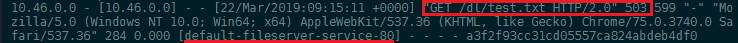


... Ok, I found the error - it was a typo in my `nginx-ingress.yaml` ... But it is good to have gone through the debug steps once, makes everything a lot less scary `:)`


### Adding TLS to your Ingress

You can generate a self-signed certificate and private key with:

```
openssl req -x509 -nodes -days 365 -newkey rsa:2048 -keyout ${KEY_FILE} -out ${CERT_FILE} -subj "/CN=${HOST}/O=${HOST}"`
```

Then create the secret in the cluster via:

```bash
kubectl create secret tls ${CERT_NAME} --key ${KEY_FILE} --cert ${CERT_FILE}
```

In my case I already use a domain name on my server, so I can head over and create my certificates with [Certbot](https://certbot.eff.org). Certbot will store the certificate inside a folder (named after your domain) inside `/etc/letsencrypt` - you will get both a `fullchain.pem` and `privkey.pem` file that you can use in the Kubernetes command above to add a Secret to your cluster:


```bash
kubectl create secret tls my-tls-secret --key /etc/letsencrypt/live/my.domain.com/privkey.pem --cert /etc/letsencrypt/live/my.domain.com/fullchain.pem
```

Now that we made our cluster aware of the existence of the TLS certificate, we can add it to our NGINX Ingress configuration file:


__nginx-ingress.yaml__

```yaml
apiVersion: extensions/v1beta1
kind: Ingress
metadata:
  name: nginx-ingress
  annotations:
    kubernetes.io/ingress.class: "nginx"
    nginx.ingress.kubernetes.io/enable-cors: "true"
    nginx.ingress.kubernetes.io/cors-allow-methods: "GET, POST, PUT"
    nginx.ingress.kubernetes.io/http2-push-preload: "true"
spec:
  tls:
  - hosts:
    - my.domain.com
    secretName: my-tls-secret
  rules:
  - http:
      paths:
        - path: /web
          backend:
            serviceName: web-service
            servicePort: 5678
        - path: /mobile
          backend:
            serviceName: mobile-service
            servicePort: 5678
        - path: /test
          backend:
            serviceName: test-service
            servicePort: 3000
        - path: /dl
          backend:
            serviceName: file-storage
            servicePort: 80
```

For more Annotations check the [official Documentation](https://github.com/kubernetes/ingress-nginx/blob/master/docs/user-guide/nginx-configuration/annotations.md)


You can now access the file server over your domain name: `https://my.domain.com/dl/test.txt`:


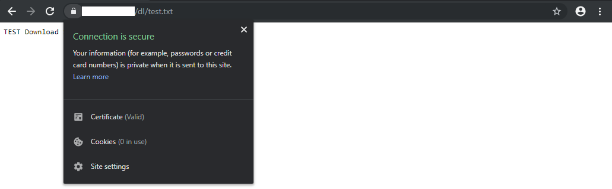


### Volume Access Control

Storage configured with a group ID (GID) allows writing only by Pods using the same GID. Mismatched or missing GIDs cause permission denied errors. To reduce the need for coordination with users, an administrator can annotate a PersistentVolume with a GID. Then the GID is automatically added to any Pod that uses the PersistentVolume.


Use the _pv.beta.kubernetes.io/gid_ annotation as follows:


__file-storage-pv.yaml__

```yaml
kind: PersistentVolume
apiVersion: v1
metadata:
  name: file-storage-volume
  annotations:
    pv.beta.kubernetes.io/gid: "1234"
  labels:
    type: local
spec:
  storageClassName: manual
  capacity:
    storage: 5Gi
  accessModes:
    - ReadWriteOnce
  hostPath:
    path: "/opt/filecontainer"
```


__file-storage-pod.yaml__

```yaml
kind: Pod
apiVersion: v1
metadata:
  name: file-storage-pod
  annotations:
    pv.beta.kubernetes.io/gid: "1234"
spec:
  volumes:
    - name: file-storage-volume
      persistentVolumeClaim:
       claimName: file-storage-claim
  containers:
    - name: file-storage-container
      image: nginx
      ports:
        - containerPort: 80
          name: "http-file-server"
      volumeMounts:
        - mountPath: "/usr/share/nginx/html"
          name: file-storage-volume
```
